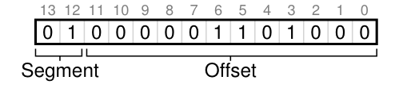
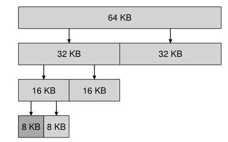

# Memory


## Address space
In early day, memory of os is divided:
- os related, starting at 0k
- your program, starting at 64k

When switching among processes, it's not efficient to store memory of a process in the disk. It's better to leave them in memory.

Due to time sharing, cpu switch process. We like to avoid memory of one process being written by the other.

Address spce is an abstraction over physical memory.

There are three components in address space:
- code
    - code that is executed
    - start at 0kb
- heap
    - keep track of memory that user allocates
    - start at 1kb
    - grow downward when user calls malloc()
- stack
    - keep track of function calls, local variable,parameters, and returned value
    - start at bottom, 16kb
    - grow upward when user calls a procedure

In reality, physical memory is scattered and does not always start at zero.

Hence, OS virtualize memory. It provides an address space for multiple running process on a single physical memory.

To achieve this, we need:
- transparency
    - Each process use address space as if it has its own private memory. It shouldn't know how os multiplex memory to multiple processes.
- efficiency
    - Don't use extra space for virtualization
    - Implementation shoudn't slow down process
- protection(isolation)
    - Each process can't modify memory of other process or os.

## address translation

To virtualize CPU, limited direct execution let process run on hardware.

Address translation use hardware to redirect app memory reference to actual location of memory.

OS duties:
- controls how memory is used
- keeps track of which location is used
- manage memory


below is an example of assembler
- ebx is the address of x
- eax is a register.
```
128: movl 0x0(%ebx), %eax ;load 0+ebx into eax
132: addl $0x03, %eax ;add 3 to eax register
135: movl %eax, 0x0(%ebx) ;store eax back to mem
```

Address doesn't always start at zero. It may start with arbitrary place in physical memory.

base and bounds
- Needs base and bound register define where code, stack and heap should be loaded in physical memory
    - physical address = base + virtual address
- Bound(size of address space) is used to prevent process from accessing memory that belongs to other process
- Since memory is calculated at run time. It's also called dynamic relocation

Each CPU has a pair of base and bound register.

MMU(memory management unit) translates memory address from virtual to physical.

OS can check the free list for available physical memory.

When process is ended, OS cleanned up physical memory of that process and add those free space to free list.

If memory is out of bound, an exception is raised by os.

OS  can switch between kernel and user mode. CPU uses a single bit(process status word) to indicate which mode the process is in.

CPU MMU stores additional base and bound register so process virtual can be converted to physical one.

Base and bound registers can be modified in kernel mode.

Exception handler is called when process tries to access out of bound address and cpu raises exception.

When context is switched, base and bound registers are stored in PCB(process control block) in memory.

When process is descheduled by cpu, its base and bound registers can be moved.

## Segmentation

To virtualize memory with base and bound register is wasteful. There are empty space between stack and heap.

Instead, we create logical segments for code, stack and heap. By specifying start and length of the segment, allocated space is not wasted

Segment is allocated when memory is used. Thus you see sparse **address space**


Segment consists of base and size which show physical memory that is allocated.


To access virtual address, 100, in code segment, add off set to the base and check it isn't out of bound
- e.g. 100 + 32K(base) = 32768(byte), assumes the start of virtual address of code is 0.

Segment violation/fault
- User process tries to access memory that is out of bound.

How to tell which segment we refer to?
- use top 2 bits of 14-bit virtual address
- e.g. 00 code, 01, heap, 10 stack

virtual address 4200
- Top two bits are 01. thus we use heap base and bound
- the next 12 bits are 104 and are offset.



code
- SEG_MASK = 0x3000
- 0x: hexadecimal format
- 3000: digits
    - convert to decimal
        - $3*16^3= 12288$

- SEG_SHIFT = 12
```
1 // get top 2 bits of 14-bit VA
2 Segment = (VirtualAddress & SEG_MASK) >> SEG_SHIFT
3 // now get offset
4 Offset = VirtualAddress & OFFSET_MASK
5 if (Offset >= Bounds[Segment])
6   RaiseException(PROTECTION_FAULT)
7 else
8   PhysAddr = Base[Segment] + Offset
9   Register = AccessMemory(PhysAddr)
```

issue with top two bits approach
1. 3 out of 4 segments are used. Space is wasted
2. Each segment can't grow over a max size

Note that stack grows backward in physical memory. Thus, the offset is calculated differntly.
- e.g. hex 0x3C00
    - binary: 11 1100 0000 0000
        - 11: stack segment
        - 1100 0000 0000 -> 3072 byte = 3KB
        - b/c stack grows backword, we have to calculate negative offset
            - 3KB - 4 KB(size of a segment) = -1 KB
        - physical address = base + negative offset

To save more memory, share code segment between processes.
- By specifying protection bit, os determine whether a process can read/write/execute data in physical memory.
- The same physical memory can be mapped to many address space from different processes.

Coarse grain segment
- address space is chopped into large segments like stack, heap, code

Find grain segment
- more and smaller segments
- require segment table
- why?
    - to improve memory efficiency, we have to know break down of the memory segment.

issues with segmentation
1. In context switch, segment registers need to be saved and restored
2. When heap doesn't have free space, allocate free space for heap segment and update the segment size
3. Segment size varies. It's not easy to allocate new space without holes -> **external fragmentation**


Thus, **compaction** can copy data of process to continuous memory block.
- con:
    1. memory and computation extensive
    2. make segment hard to grow

Alternatively, use free-list management to track free space. Process can allocate memory from free list that fits their need
- e.g. best-fit, first-fit, buddy algorithm

## Free Space Management

malloc: given size, return pointer to the memory in heap with that size
- Note that once memory is allocated you can't relocate it. Thus compaction doesn't work.

free: given pointer, free memory in heap for that pointer.
- note that os has to keep track of size of the pointer somehow

Internal fragmentation: empty space in heap when allocated memory in heap is larger than usage.

Scenario
1. allocate memory larger than 10 bytes
2. allocate memory equal to 10 bytes
    - 
    - 
3. allocate memory smaller than 10 bytes, **split**
    - 
4. (continue from 2)free 10 bytes and **coalesce** current and nearby free space into continuous free space
- 
- 

Each allocated memory has **header** along with it. It stores size of allocation which is used in free call.
```
typedef struct {
    int size;
    int magic;
} header_t;
```


given a pointer to the free space, calculate pointer to the header with pointer arithmetic
```
header_t *hptr = (header_t *) ptr - 1;
```

Use node as header to track list of free space
```
typedef struct __node_t {
    int size;
    struct __node_t *next;
} node_t;
```

call mmap to allocate free space in heap
- a single node for free space, $4096 - 8 = 4088 bytes$
- start at virtual address, 16KB
- 

allocate 100 bytes
- this node is splitted into 108-byte and 3988-byte node
- pointer to 100-byte free space is returned
- header is moved to the start of free list
- 

allocate two more 100 bytes space
- 

free the middle allocated space
- move header to middle allocated node
- point next to the previous header


free the rest of allocated space
- move header around and build next pointer
- you can see internal fragmentation even though they form a continuous block.


When allocation library runs out of space in heap
1. make system call, sbrk, to grow heap size
2. return null as error

Every allocation policy has it strength and weakness. There is no best approach.
- best fit
    - pro: space is not wasted
    - con: cost of linear scan
- worst fit
    - pro: leave more large chunks in free list
    - con: cost of linear scan
- first fit
    - pro: fast scan in best case
    - con: scan is slow when free list has many small chunk at head
- next fit
    - pro: avoid splinter at the head
    - con: have to track two pointers

Segregated list is dedicated for popular size request. When free space in segregated list is running low, slab allocator ask for a slab of memory from general memory allocator.
- how much should you ask for slab depend on page size and number of objects allocated
- pro
    - can serve fix size request quickly
    - less fragmentation

Buddy allocation treats free space having size of $2^N$. Recursively split the space into half. When a buddy in one half is free and has enough space for the request, return pointer.
- pro: easy to coalesce since next buddy and current buddy differ only by one bit


other allocation technique that scales:
1. advance data structure
    - balanced binary tree
    - splay tree
    - partially ordered tree
2. runs on multiple processor

to see how real world allocator works: [Understanding glibc malloc](https://sploitfun.wordpress.com/2015/02/10/understanding-glibc-malloc/)

## Paging

Segmentation divides virtual memory into variable-sized chunk. It tracks memory usage better but introduce fragment.

Paging divides virtual memory into fixed-sized chunk and thus avoids fragment.

Page
- a fixed-sized unit in address space

Page frame
- a fixed-sized slot in physical memory that can be assigned a page

*64 bytes address space in 128 bytes physical memory*
- Physical memory is divided into fixed-sized slots
- note that a page frame is reserved for OS
- Few page frames are not used
- The rest are assigned to pages in address space
    - Page are not arranged in order.

advantage of paging
- good abstraction
    - you don't have to worry about how stack/heap grow to implement your translation
- simple to grab free page from free list

page table
- store address translation per process
    - i.e. map virtual page number to page frame number

*virtual address of 21*
- movl 21, %eax
    - copy value of address, 21, to general purpose register, %eax
- virtual address 21 refers to virtual page 1 with 5 bytes offset
    - binary of 21 = 010101
- Since each page is 16 byte, we need 4 bits for offset
- The size of address space is 64 byte. Since there are 4 pages intotal, we need top two bits for virtual page number
- generally, for address space with size N, we need $\log_2N$ bits for each address


virtual page number is translated to physical address before OS issues load to physical memory.

Page table
- map virtual address to physical address
- usually resides in virtual memory and sometimes swapped to disk

linear page table
- use array to store physical page frame
    - index is virtual page number

*page table entry (PTE)*
- PTE resides in page table; size ~=4 bytes
- valid bit: mark unused space in address space as invalid
    - process traps to os when it tries to read invalid address
    - os won't allocate physical page frame for invalid address
        - to save memory
- protection bitst: whether page can be read/written/executed
- present bit: whether virtual page is in physical memory or disk
    - e.g. swap out rarely used page when address space outgrow physical memory
- dirty bit: whether page is modified since page is brought to memory
- reference bit: whether page is accessed
    - useful for page replacement

*access memory with paging*
- memory address of page table is stored in register
- VPN_MASK: 110000
- SHIFT: 4
- for virtual address, 21, VPN = 1 and PTEAddr
- OFFSET_MASK: 1111
- PFN: physical frame number, which is extracted from PTE
- offset: number of bytes away from the base of page
- note that it is computation expensive to fetch PTE from memory

## Translation look aside buffer

Page table is stored in memory. If every instruction fetch and memory access needs to find page table, it’s too slow. To speed things up, we need support from hardware.

TLB(translation look aside buffer)
- It’s part of memory management unit
- Also called address translation cache
- OS looks up TLB before it look up page table in physical memory

TLB hit
- Virtual page number is stored in TLB and is found

TLB miss
- Virtual page number isn’t stored in TLB; thus OS looks up page table in physical memory for virtual address.
- After virtual address is found, physical address(physical frame number) is calculated.
- Then, TLB is updated with physical frame number and instruction is retried.
- When it happens, memory access becomes very slow because extra lookup in TLB is required.

WHO handles TLB miss
- Software (os)
    - Simple
        - Hardware raises exception when TLB miss. DO nothing else
        - OS take care of TLB miss handler of trap.
    - flexible
        - OS can uses any data structure to implement TLB without hardware changes

TLB content
- Fully associated
    - Hardware searched full TLB in parallel to find a match of virtual address.
- Format
    - VPN
    - PFN
    - Other bits
        - Valid
            - Translation is valid or not
        - Protection
            - Read/write/execute?
        - Dirty
        - Address space identifier

TLB issues
- Context switch happens when another process likes to run. Same virtual page number may differ in physical frame number for different process. Thus, TBL has to tell which process does this virtual page number belong to
- Sol
    - Flush
        - Turn valid bits to zero when hardware detects base register of a page table changes
            - con
                - Every context switch incurs TLB miss. The cost is high
    - Address space identifier
        - It’s used to identify which process is running
        - ASID of current process is stored in privilege register when context is switched
        - It resolved TLB miss since address translation of different process can be stored in TLB

Replacement policy
- When new entry is added to TLB, old one has to be replaced
- We choose policy to minimized TLB miss and to increase performance
- Policy
    - Random
    - LRU(least recently used)

Real TLB entry
- MIPS uses software managed TLB.
- MIPS supports 32-bit address space and 4KB(4k bytes) page size
    - Need 12 bits for offset because:
        - One Page size = 4,096 bytes
        - How many bits are needed to represent 4096?
            - 2^k = 4096; k = 12
        - The rest of 20 bits is for virtual page number
- Privileged instructions
    - TLBWI
        - Write to specific entry in TLB
    - TLBWR
        - Replace entry in TLB randomly
    - TLBP
        - Probe entry in TLB
    - TLBR
        - Read entry in TLB
- Structure
    - VPN
    - Not used slot
    - G
        - Whether address. can be shared
    - ASID
        - Address space identifier
    - PFN
        - Physical frame number
    - C
        - Coherence, how entry is written to TLB
    - D
        - Dirty, whether address is updated in TLB
    - V
        - Valid, whether address translation is valid or not
- Some entries in TLB are reserved for os kernel. A wired register is used to store how many such entries exist

## Policy

Replacement policy
- OS has to decided which page in physical memory to evict when OS is running out of memory.
    - It indicates that free page list doesn’t have any more free page.
- When choosing a policy, we likes to maximize cache hits and minimize cache miss

Cache management
- Average memory access time
    - $AMAT = T_M + P_m*T_D$
        - $T_M$: cost of  memory access
        - $P_m$: probability of cache miss
        - $T_D$: cost of disk access
    - Since the cost of disk access is so high, we likes to minimize $P_m$
        - Usually, $T_D$ in 10 ms and $T_M$ in 100 ns
- Cold start miss
    - When cache is empty, cache miss will happen definitely

Policy
- Optimal replacement policy
    - Furthest in the future
    - Con
        - You can’t predict the future as OS is for general purpose.
- FIFO
    - First in first out
    - Page at the tail of the queue is evicted
    - con:
        - Low cache hit rate
            -  Page is evicted based on whether it’s first brought into memory rather than how those page is used
- Random
    - Choose a random page in the cache
    - Cache hit rate depends on luck of the draw
- LRU
    - Least recently used
    - If a page has been accessed in the near past, it’s likely to access that page again in the future
- LFU
    - Least frequently used
    - Pages which aren’t accessed frequently should be evicted

Workload example
- When cache size is big enough to hold every page, which policy is chosen doesn’t matter.
- When workload is random, optimal strategy is the best
- When workload has locality(e.g. 80% of references targets 20% of pages), optimal and LRU work best
- When workload is sequential(e.g. access page 1, 2, 3,… 100 in order), random and optimal work best.
- Note than random doesn’t have weird corner case.

Historical algo
- Hardware can update time field to current in memory when memory is accessed. To replace least recently used page, simply scan through time field of all page and pick the oldest
    - con: cost is expensive. e.g. for 4 GB memory size and 4KB page size, there are million of pages which are a lot to scan even for modern CPU

Approximate algo
- Clock algorithm
    - Use clock hand to point to a page, check it reference bit. If $reference bit = 1$, page has been used recently. Set it to zero and move to the next bit until a zero reference bit is found and return that page.

Dirty Page
- Hardware set dirty bit(modified bit) when page is changed
- Eviction is first made to page that is clean.

Page selection: it determines when page is brought to memory
- Demanding page
    - Load page into memory when OS requires it
- Prefetching
    - Predict the use of page and load it into memory

How page is written to disk
- Clustering or grouping
    - Collect pending writes and write them to disk
        - It efficient because structure of disk lets large single write more efficient

Thrashing
- It happens when memory demand of the process is more than what is available
- Admission control
    - Only allows subset of process to subscribe to memory
- Out of memory killer
    - Daemon chooses a memory intensive process and kills it
